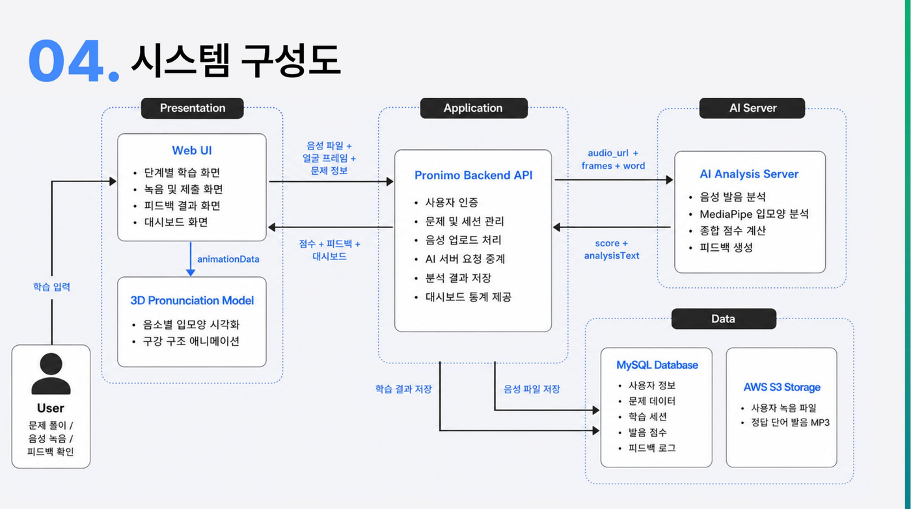
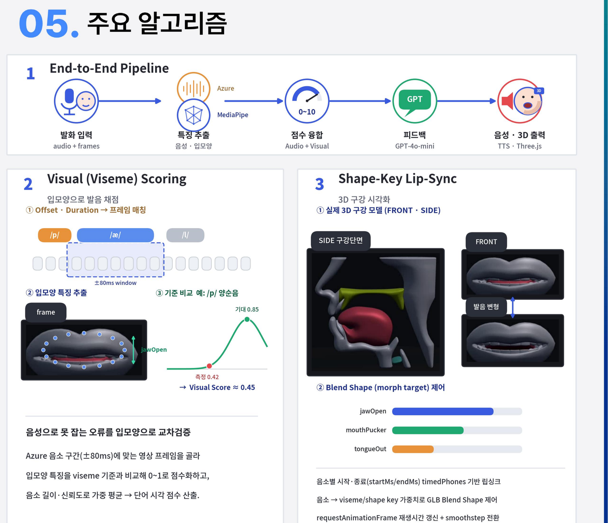

# pronimo AI Server

**3D 구강 시각화와 AI 피드백으로 발음을 교정하는 영어 학습 플랫폼 — pronimo**의 AI 서버.
사용자가 영어 단어를 발음하면 **음성(Azure)** 과 **입모양(MediaPipe)** 을 동시에 분석해 점수를 매기고, **GPT 피드백 + TTS 음성**을 생성하며, FE의 **3D 구강 모델** 립싱크에 필요한 데이터를 제공한다.

> 전체 파이프라인(FE → Backend → AI Server → 외부 서비스)의 상세 설명은 [README_파이프라인.md](README_파이프라인.md) 참고.

## 핵심 키워드

| | | |
|---|---|---|
| **AI 발음 분석** | 사용자의 음성을 AI 서버로 전송하여 발음 정확도를 분석하고, 단어별 음성 점수와 종합 점수를 계산 |
| **입모양 인식** | MediaPipe를 활용해 사용자의 얼굴 프레임과 입모양 데이터를 수집, 발음 시 입의 움직임을 분석 |
| **3D 발음 모델** | 단어별 음소 데이터를 기반으로 3D 모델의 입모양 애니메이션을 재생해 발음 형태를 시각적으로 제공 |
| **맞춤형 피드백** | 분석 결과를 바탕으로 문장별 피드백, 음성 피드백, 학습 대시보드를 제공하여 약점을 쉽게 확인 |

---

## 아키텍처

| 계층 | 스택 | 역할 |
|---|---|---|
| Frontend | React + TypeScript + Three.js + MediaPipe | 음성 녹음·얼굴 캡처, 결과·3D 구강 렌더 |
| Backend | Spring Boot (Java 17) + MySQL + AWS S3 | 게이트웨이(JWT), 오디오 저장, AI 서버 중계, 점수·이력 저장 |
| **AI Server (본 저장소)** | FastAPI (Python) | 발음 분석·점수·피드백 텍스트·TTS 오케스트레이션 |
| 외부 | Azure Speech / OpenAI GPT-4o-mini / Supertone TTS | 발음평가 / 캐릭터 피드백 / 음성합성 |

### 시스템 구성도



`Web UI`(Presentation) → `Pronimo Backend API`(Application) → `AI Analysis Server`가 음성 발음 분석·MediaPipe 입모양 분석·종합 점수 계산·피드백 생성을 담당하고, `MySQL`(사용자/세션/점수/피드백 로그)과 `AWS S3`(녹음 파일·합성 음성)에 결과를 저장한다.

## 엔드포인트

- `POST /analyze` — 오디오(S3 presigned URL) + 프레임(MediaPipe landmarks/blendshapes)을 받아 음성·시각 점수를 융합해 반환.
- `POST /feedback-wav` — 분석 텍스트를 받아 GPT 피드백(mild/spicy 캐릭터)과 TTS 음성(WAV, base64)을 생성.

## 핵심 기술



1. **End-to-End Pipeline**: 발화 입력(audio + frames) → Azure/MediaPipe 특징추출(음성·입모양) → 0~10 점수 융합 → GPT-4o-mini 피드백 → Supertone TTS 음성·3D 출력.
2. **Viseme Scoring** (`app/services/visual_viseme_scorer.py`): 음소를 viseme로 매핑하고, Azure 발음평가의 Offset/Duration으로 프레임을 ±80ms 윈도 정렬한 뒤, 4종 기법(pattern/absolute/gaussian/skip)으로 입모양을 채점 — 음성으로 못 잡는 오류를 입모양으로 교차검증해 음성 점수와 신뢰도 가중 융합.
3. **Shape-Key Lip-Sync 데이터 제공**: FE의 `ShapeKeyModelViewer`가 실시간 파형 분석이 아닌 음소별 시간 정보(startMs/endMs) 기반 viseme 타임라인 재생 방식으로 3D 구강 모델(FRONT·SIDE)의 입·혀 움직임(jawOpen·mouthPucker·tongueOut 등 Blend Shape)을 보여줄 수 있도록, 분석 결과에 음소별 시간 정보를 포함해 반환.

## 디렉터리 구조

```
app/
├── main.py                # FastAPI 엔트리포인트
├── api/routes.py           # /analyze, /feedback-wav 라우팅 및 오케스트레이션
├── schemas/request.py      # 요청/응답 스키마
├── services/
│   ├── audio_fetcher.py            # S3에서 오디오 다운로드
│   ├── raw_frame_adapter.py        # MediaPipe raw → 17개 정규화 입모양 특징
│   ├── azure_pa.py                 # Azure 발음평가 호출
│   ├── viseme_mapper.py            # 음소 → viseme 매핑
│   ├── audio_scorer.py             # 음성 점수 산출
│   ├── frame_aligner.py            # 음소 시간 윈도에 프레임 정렬
│   ├── visual_viseme_scorer.py     # viseme별 시각 점수 산출
│   ├── fusion_scorer.py            # 음성·시각 점수 융합
│   ├── feedback_payload_builder.py # 0~10 점수·등급·응답 페이로드 구성
│   ├── analysis_text_builder.py    # 규칙 기반 분석 텍스트 생성
│   ├── llm_feedback.py             # GPT-4o-mini 캐릭터 피드백 생성
│   └── tts_supertone.py            # Supertone TTS 합성
└── data/
    ├── phoneme_to_viseme_map.json
    ├── viseme_feature_profile.json
    └── mediapipe_mouth_feature_catalog.json
```

## 환경 변수 (`.env`)

```
AZURE_SPEECH_KEY=
AZURE_SPEECH_REGION=
OPENAI_API_KEY=
SUPERTONE_API_KEY=
AWS_ACCESS_KEY_ID=
AWS_SECRET_ACCESS_KEY=
AWS_REGION=
```

## 실행

```bash
cd app
pip install -r requirements.txt
uvicorn main:app --reload
```

## 참고 문서

- [README_파이프라인.md](README_파이프라인.md) — FE/Backend/AI Server 전체 파이프라인 단계별 설명, viseme scoring·3D shape-key 립싱크 상세
- [API_SCHEMA.md](API_SCHEMA.md) — API 요청/응답 스키마
- [BACKEND_DTO.md](BACKEND_DTO.md) — 백엔드 연동 DTO 명세
