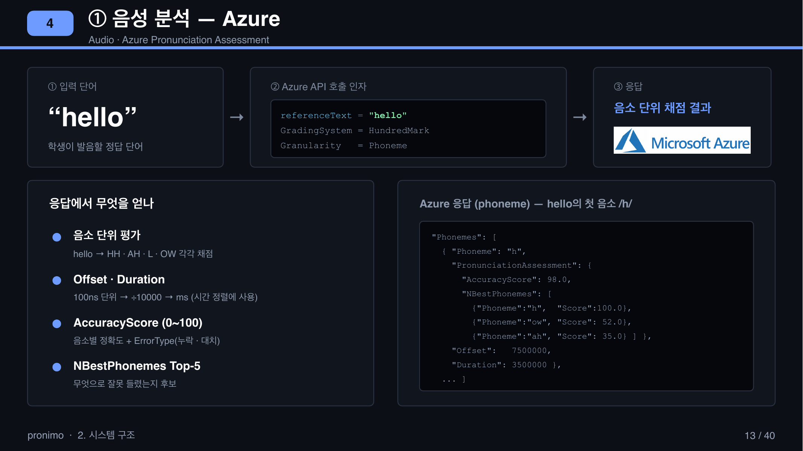
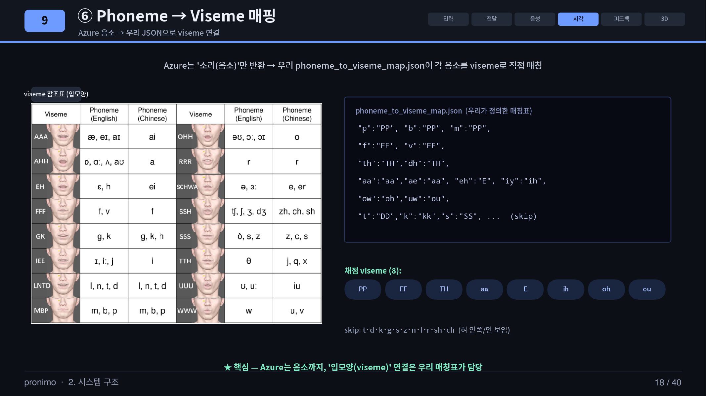
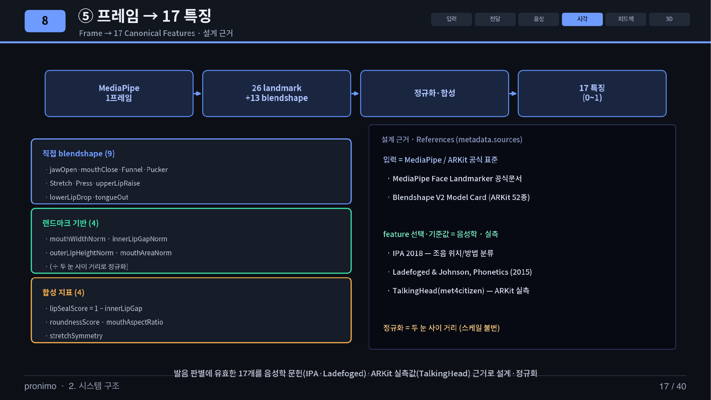
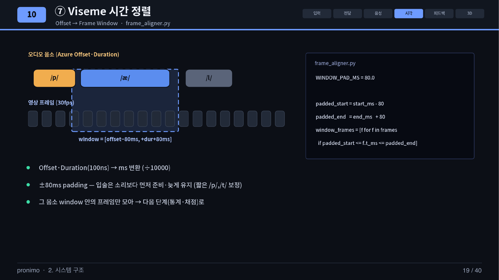
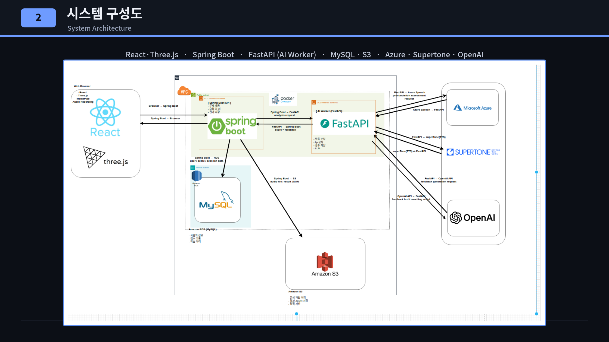

<h1 align="center">Pronimo AI Server</h1>

<p align="center">
  <strong>음소 타이밍 정렬 기반 음성·입모양 융합 발음 평가 서버</strong>
</p>

<p align="center">
  
  
  
  
  
  
</p>

<p align="center">
  <a href="#project-overview"><strong>Overview</strong></a> ·
  <a href="#demo"><strong>Demo</strong></a> ·
  <a href="#my-role--contribution"><strong>My Contribution</strong></a> ·
  <a href="#ai-core-pipeline"><strong>AI Pipeline</strong></a> ·
  <a href="#api"><strong>API</strong></a> ·
  <a href="#getting-started"><strong>Getting Started</strong></a>
</p>

Pronimo는 사용자의 **음성**과 웹캠에서 수집한 **입모양**을 함께 분석하는 영어 발음 교정 서비스입니다. AI 서버는 Azure가 반환한 음소별 시간 정보와 MediaPipe 프레임을 동일한 시간축에서 정렬하고, phoneme-viseme 매핑을 기반으로 발음 오류를 구분합니다.

분석 결과는 음성 점수, 입모양 점수, 종합 점수와 한국어 교정 문장으로 제공되며, 프론트엔드의 3D 구강 모델과 캐릭터 음성 피드백으로 연결됩니다.

## Demo

<p align="center">
  <a href="pronimo-demo-video.zip">
    
  </a>
</p>

<p align="center">
  <a href="pronimo-demo-video.zip"><strong>▶ 전체 시연 영상 다운로드 (.zip, 25 MB)</strong></a><br />
  <sub>녹화 → 음성·입모양 분석 → 음소별 교정 피드백으로 이어지는 전체 사용자 흐름</sub>
</p>

<p align="center">
  
</p>

<p align="center"><sub>실제 분석 결과 화면: 음성·입모양 점수를 분리하고 교정 대상 음소를 3D 구강 모델과 함께 제공합니다.</sub></p>

## Project Overview

| 항목 | 내용 |
|---|---|
| 프로젝트 | AI 기반 3D 영어 발음 교정 서비스 **Pronimo** |
| 개발 기간 | 2026.03 - 2026.06 |
| 팀 구성 | 4인 협업 프로젝트 |
| 담당 영역 | **AI Server 및 발음 분석 알고리즘 설계·구현** |
| 핵심 차별점 | 음성 평가와 입모양 분석을 음소 단위로 결합 |

기존 음성 중심 발음 평가는 점수는 알려주지만, 사용자가 입술과 혀를 어떻게 교정해야 하는지 설명하기 어렵습니다. Pronimo는 음성을 phoneme 단위로 나누고, 각 phoneme을 시각적 조음 단위인 viseme과 연결해 소리와 입모양을 함께 진단합니다.

## My Role & Contribution

- FastAPI 기반 `/analyze`, `/feedback-wav` API 설계
- Azure Pronunciation Assessment 음소 결과 파싱 및 자체 음성 점수 산출
- 32개 phoneme을 15개 viseme으로 변환하는 매핑 테이블 설계
- MediaPipe landmark·blendshape를 17개 canonical feature로 정규화
- 음소의 `Offset`·`Duration`과 영상 프레임 timestamp 정렬
- viseme별 채점 방식과 시각 신뢰도를 반영한 점수 계산
- 음성·시각 점수 융합 및 audio-visual 불일치 진단
- GPT-4o-mini 피드백과 Supertone 캐릭터 TTS 병렬 생성
- 외부 API 오류, 파일 크기, timeout, 임시 파일 수명주기 처리

## AI Core Pipeline

```text
WAV + MediaPipe Frames
        │
        ├─ Azure Speech ─> Phoneme · Accuracy · Offset · Duration
        │                                      │
        └─ Face Frames ─> 17 Visual Features   │
                                               ▼
                  Phoneme ─> Viseme Mapping ─> Phoneme Frame Window
                                               │
                                               ▼
                         Visual Scoring ─> Confidence-aware Fusion
                                               │
                                               ▼
                            0-10 Score · Diagnosis · GPT/TTS Feedback
```

### 1. Azure에서 음소와 시간 정보를 얻습니다

Azure Pronunciation Assessment를 `Granularity=Phoneme`으로 호출합니다. AI 서버는 단순한 전체 점수가 아니라 다음 필드를 후속 분석에 사용합니다.

| Azure 필드 | 의미 | AI 서버에서의 용도 |
|---|---|---|
| `Phoneme` | 인식한 음소 | viseme 매핑 키 |
| `AccuracyScore` | 음소별 정확도 | 음소·단어 음성 점수 |
| `Offset` | 음소 시작 위치 | 영상 프레임 정렬 시작점 |
| `Duration` | 음소 지속시간 | 프레임 윈도 종료점과 지속시간 가중치 |
| `NBestPhonemes` | 실제 발화로 추정한 후보 음소 | 대치 발음과 audio-visual 불일치 진단 |
| `ErrorType` | 생략·오발음 등의 오류 정보 | 오류 유형별 피드백 생성 |

<p align="center">
  
</p>

Azure의 `Offset`과 `Duration`은 100ns tick 단위이므로 영상 timestamp와 비교할 수 있도록 밀리초로 변환합니다.

```text
start_ms    = Offset / 10,000
duration_ms = Duration / 10,000
end_ms      = start_ms + duration_ms
```

예를 들어 `Offset=7,500,000`, `Duration=3,500,000`이면 해당 음소는 녹음 시작 후 `750ms`부터 `350ms` 동안 발음된 구간으로 해석합니다.

관련 코드: [`azure_pa.py`](app/services/azure_pa.py)

### 2. Phoneme을 Viseme으로 직접 매핑합니다

Azure는 발음의 **소리 단위인 phoneme**을 반환하지만, 입모양 단위인 viseme은 반환하지 않습니다. 따라서 `phoneme_to_viseme_map.json`에 정의한 대응표를 이용해 32개 phoneme을 15개 viseme 식별자로 변환합니다.

<p align="center">
  
</p>

```text
/p/, /b/, /m/  ─> PP  ─> 입술 폐쇄 패턴
/f/, /v/       ─> FF  ─> 아랫입술과 윗니의 접촉
/th/, /dh/     ─> TH  ─> 혀 돌출
/aa/, /ae/     ─> aa  ─> 턱 개방과 입의 면적
/ow/, /uw/     ─> oh/ou ─> 입술 둥글기
```

15개 viseme 중 정면 카메라로 의미 있게 관찰 가능한 8개 그룹만 시각 채점합니다. 혀 안쪽이나 연구개 움직임처럼 보이지 않는 그룹은 `skip` 처리하고 음성 점수만 사용합니다.

관련 코드: [`phoneme_to_viseme_map.json`](app/data/phoneme_to_viseme_map.json), [`viseme_mapper.py`](app/services/viseme_mapper.py)

### 3. 한 프레임을 17개 입모양 특징으로 변환합니다

프론트엔드에서 전송한 26개 landmark와 13개 mouth-region blendshape를 정규화·합성해 한 프레임당 17개 특징을 만듭니다. 얼굴 크기와 촬영 거리의 영향을 줄이기 위해 두 눈 바깥점 사이 거리를 기준 길이로 사용합니다.

<p align="center">
  
</p>

대표 특징은 `jawOpen`, `mouthPucker`, `innerLipGapNorm`, `mouthAreaNorm`, `lipSealScore`, `roundnessScore`, `tongueOut`입니다.

관련 코드: [`raw_frame_adapter.py`](app/services/raw_frame_adapter.py), [`visual_viseme_scorer.py`](app/services/visual_viseme_scorer.py)

### 4. 음소 구간과 영상 프레임을 같은 시간축에서 정렬합니다

MediaPipe 프레임의 `t_ms`와 Azure 음소 구간을 비교해 각 phoneme에 해당하는 프레임만 모읍니다. 입술은 소리보다 먼저 움직이거나 늦게 유지될 수 있으므로 원본 구간 양쪽에 `80ms`를 추가합니다.

<p align="center">
  
</p>

```text
phoneme interval = [start_ms, start_ms + duration_ms]
frame window     = [max(0, start_ms - 80), end_ms + 80]
window frames    = frames where frame.t_ms is inside the window
```

유효 프레임이 2개 미만이면 통계 기반 평가가 어렵다고 판단해 해당 viseme의 시각 신뢰도를 `0`으로 설정합니다.

관련 코드: [`frame_aligner.py`](app/services/frame_aligner.py)

### 5. Viseme별 방식으로 채점하고 음성 결과와 융합합니다

| 분석 방식 | 적용 예 | 판단 기준 |
|---|---|---|
| Pattern detection | `PP` | 음소 구간에 입술 폐쇄 peak가 발생했는지 확인 |
| Absolute detection | `TH` | `tongueOut` 특징이 임계값을 넘는지 확인 |
| Gaussian matching | 모음, `FF` | 목표 입모양 특징과 관측값 사이의 유사도 계산 |
| Skip | 정면에서 관찰하기 어려운 viseme | 시각 신뢰도 0, 음성 점수만 반영 |

단어 점수는 시각 분석이 가능한 경우 음성 75%, 입모양 25%를 기본으로 사용합니다. 음소별 융합에서는 viseme의 시각 신뢰도 `r`을 곱해 실제 가중치를 조정합니다.

```text
effective_visual_weight = 0.25 × r
effective_audio_weight  = 1.00 - effective_visual_weight

fused = effective_audio_weight × audio_score
      + effective_visual_weight × visual_score
```

관련 코드: [`visual_viseme_scorer.py`](app/services/visual_viseme_scorer.py), [`fusion_scorer.py`](app/services/fusion_scorer.py)

## System Architecture

Pronimo는 Frontend, Backend, AI Server가 분리된 구조입니다. 이 저장소의 책임 범위는 **AI 분석·융합·피드백 생성**이며, 인증·학습 세션·영속화는 Spring Boot Backend가 담당합니다.

<p align="center">
  
</p>

<p align="center"><sub>전체 시스템 구성: React·Three.js, Spring Boot, FastAPI AI Worker, MySQL·S3 및 외부 AI 서비스 연동</sub></p>

### AI Server Responsibility

<p align="center">
  
</p>

<p align="center"><sub>보조 구성도: 전체 서비스에서 AI 서버가 담당하는 분석·점수 융합·피드백 생성 범위</sub></p>

| 계층 | 기술 | 책임 |
|---|---|---|
| Frontend | React, TypeScript, Three.js, MediaPipe | 녹음·얼굴 프레임 수집, 결과·3D 구강 렌더링 |
| Backend | Spring Boot, MySQL, AWS S3 | 인증, 세션, 오디오 저장, AI 서버 중계, 결과 저장 |
| **AI Server** | **FastAPI, Python** | **음성·입모양 분석, 점수 융합, 피드백·TTS 생성** |
| External AI | Azure Speech, OpenAI, Supertone | 발음 평가, 문장 생성, 음성 합성 |

발표 원본: [`cap발표.pptx`](제출자료/cap발표.pptx)

<details>
<summary><strong>상세 요청 시퀀스 보기</strong></summary>
<br/>
<p align="center">
  
</p>
</details>

## API

### `POST /analyze`

S3 presigned audio URL과 MediaPipe 프레임을 받아 음성·입모양 분석 결과를 반환합니다.

```json
{
  "word": "apple",
  "scores": {
    "overall_0_10": 8.2,
    "audio_0_10": 8.5,
    "visual_0_10": 7.1,
    "band": "good"
  },
  "analysis_text": "음성: /p/가 /b/처럼 들렸어요. 정확한 소리로 다시 내봐요.\n입모양: /p/ 입모양을 정확하게 잡았어요."
}
```

### `POST /feedback-wav`

분석 문장을 받아 서로 다른 말투의 캐릭터 음성 2개를 병렬 생성합니다.

```json
{
  "mild_wav_base64": "UklGR...",
  "spicy_wav_base64": "UklGR...",
  "audio_format": "audio/wav"
}
```

전체 요청·응답 스키마는 [`API_SCHEMA.md`](API_SCHEMA.md)에서 확인할 수 있습니다.

## Tech Stack

| Category | Technology | 사용 목적 |
|---|---|---|
| API | Python, FastAPI, Pydantic | 비동기 API와 요청·응답 검증 |
| Speech | Azure Pronunciation Assessment | 음소별 점수·후보·시간 정보 획득 |
| Vision | MediaPipe Face Landmarker | landmark와 blendshape 수집 |
| Feedback | OpenAI GPT-4o-mini | 분석 근거를 캐릭터 피드백으로 변환 |
| Voice | Supertone TTS | 캐릭터별 한국어 음성 생성 |
| Storage | AWS S3 Presigned URL | 백엔드에 저장된 WAV 전달 |
| HTTP | HTTPX | 스트리밍 다운로드와 비동기 외부 API 호출 |

## Getting Started

### 1. Install

```bash
git clone https://github.com/TEAM-PRONIMO/AIserver.git
cd AIserver

python -m venv .venv
source .venv/bin/activate
pip install -r app/requirements.txt
```

### 2. Configure

저장소 루트에 `.env`를 생성합니다.

```dotenv
AZURE_SPEECH_KEY=
AZURE_SPEECH_REGION=
OPENAI_API_KEY=
SUPERTONE_API_KEY=
```

> AI 서버는 AWS 자격 증명을 직접 사용하지 않고 Backend가 발급한 S3 presigned URL을 입력으로 받습니다. 실제 API 키는 커밋하지 마세요.

### 3. Run

```bash
uvicorn app.main:app --reload
```

- Swagger UI: `http://127.0.0.1:8000/docs`
- OpenAPI JSON: `http://127.0.0.1:8000/openapi.json`

## Repository Structure

```text
app/
├── main.py                       # FastAPI entry point
├── api/routes.py                 # API orchestration
├── schemas/request.py            # Pydantic request/response models
├── services/
│   ├── azure_pa.py               # Azure pronunciation assessment
│   ├── raw_frame_adapter.py      # MediaPipe frame normalization
│   ├── frame_aligner.py          # Phoneme-frame temporal alignment
│   ├── visual_viseme_scorer.py   # Viseme-based visual scoring
│   ├── fusion_scorer.py          # Audio-visual score fusion
│   ├── llm_feedback.py           # GPT character feedback
│   └── tts_supertone.py          # Character voice synthesis
└── data/
    ├── phoneme_to_viseme_map.json
    ├── viseme_feature_profile.json
    └── mediapipe_mouth_feature_catalog.json
```

## Documentation

- [`README_파이프라인.md`](README_파이프라인.md) - 전체 분석 단계와 3D shape-key 연동
- [`README_AI_HANDOFF.md`](README_AI_HANDOFF.md) - AI 서버 운영 및 인수인계 가이드
- [`API_SCHEMA.md`](API_SCHEMA.md) - API 요청·응답 명세
- [`BACKEND_DTO.md`](BACKEND_DTO.md) - Spring Boot 연동 DTO
