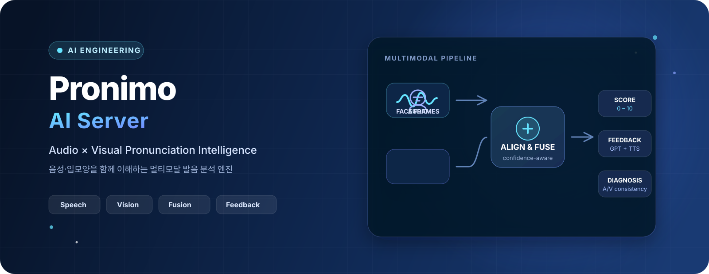
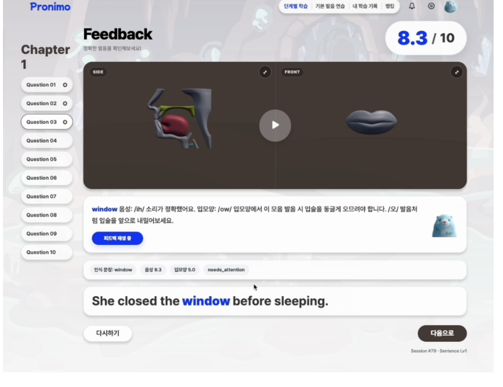
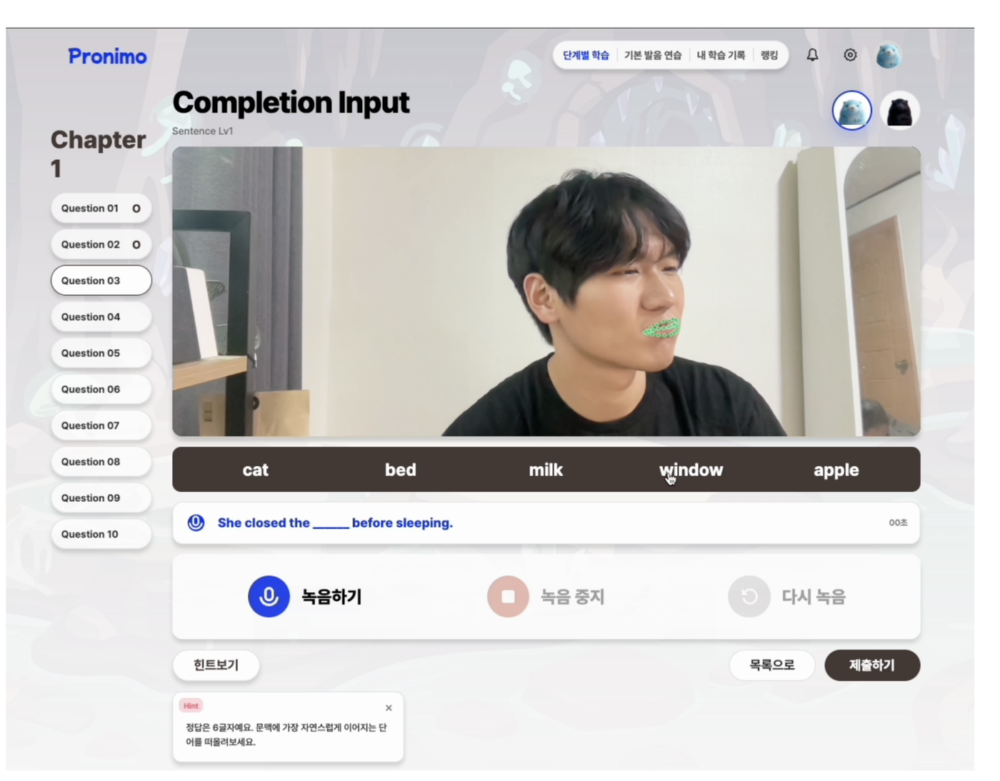
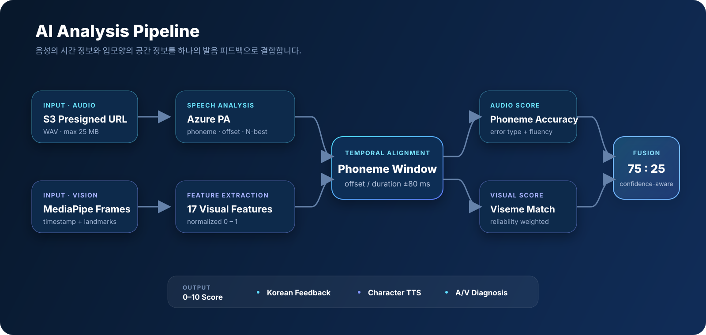
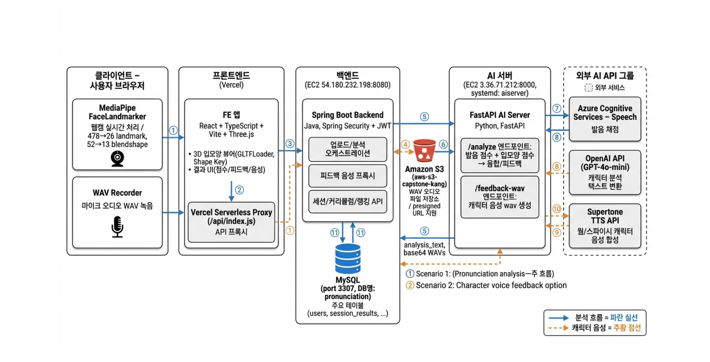

<p align="center">
  
</p>

<p align="center">
  <a href="#demo"><strong>Demo</strong></a> ·
  <a href="#my-role--contribution"><strong>My Contribution</strong></a> ·
  <a href="#ai-analysis-pipeline"><strong>AI Pipeline</strong></a> ·
  <a href="#api"><strong>API</strong></a> ·
  <a href="#getting-started"><strong>Getting Started</strong></a>
</p>

<p align="center">
  
  
  
  
  
  
</p>

> **Pronimo**는 사용자의 영어 발음을 소리로만 평가하지 않습니다. 음성의 음소 정보와 웹캠으로 수집한 입모양을 함께 분석해, 사용자가 **무엇을 틀렸고 입을 어떻게 움직여야 하는지** 이해할 수 있는 피드백을 제공합니다.

이 저장소는 Pronimo 전체 서비스 중 **AI 분석 서버**를 담당합니다. Azure Speech의 음소 단위 평가 결과와 MediaPipe 얼굴 프레임을 시간축으로 정렬하고, 신뢰도 기반으로 점수를 융합한 뒤 한국어 분석 피드백과 캐릭터 음성을 생성합니다.

<table>
  <tr>
    <td align="center"><strong>32</strong><br/><sub>Phoneme Mappings</sub></td>
    <td align="center"><strong>15</strong><br/><sub>Viseme Profiles</sub></td>
    <td align="center"><strong>17</strong><br/><sub>Visual Features</sub></td>
    <td align="center"><strong>±80 ms</strong><br/><sub>Alignment Window</sub></td>
    <td align="center"><strong>2</strong><br/><sub>Core APIs</sub></td>
  </tr>
</table>

## Demo

사용자가 발음을 녹음하면 음성 데이터와 MediaPipe 얼굴 프레임이 함께 수집됩니다. AI 서버는 **종합 점수·음성 점수·입모양 점수·교정 문장**을 반환하며, 프론트엔드는 이 결과와 정면·측면 3D 구강 모델을 함께 보여줍니다.

<p align="center">
  
</p>

<p align="center"><sub>음성 평가와 입모양 평가를 분리해 보여주고, 교정이 필요한 음소를 3D 구강 움직임으로 확인합니다.</sub></p>

<details>
<summary><strong>발음 녹음 화면 보기</strong></summary>
<br/>
<p align="center">
  
</p>
</details>

## Project Overview

| 항목 | 내용 |
|---|---|
| 프로젝트 | 다국어 발음 교정용 3D 아바타 학습 서비스 **Pronimo** |
| 개발 기간 | 2026.03 – 2026.06 |
| 팀 구성 | 2인 팀 프로젝트 |
| 담당 영역 | AI Server 설계 및 구현 |
| 핵심 목표 | 음성 평가와 입모양 분석을 결합해 구체적인 발음 교정 근거 제공 |

기존 발음 학습 서비스는 정확도 점수를 알려줄 수 있지만, 학습자가 **왜 틀렸는지**, **입술과 혀를 어떻게 움직여야 하는지** 이해하기 어렵습니다. Pronimo는 이 문제를 다음 흐름으로 해결합니다.

1. Azure Speech로 발음을 음소 단위까지 분석합니다.
2. 동일한 발화 구간의 MediaPipe 입모양 특징을 계산합니다.
3. 카메라로 관찰 가능한 정도를 반영해 두 점수를 융합합니다.
4. 교정 문장과 캐릭터 TTS 음성을 생성해 3D 발음 학습 경험과 연결합니다.

## My Role & Contribution

### 1. AI 분석 파이프라인 설계

- FastAPI 기반으로 `/analyze`, `/feedback-wav` API를 설계했습니다.
- S3 presigned URL의 WAV와 MediaPipe 프레임을 하나의 분석 요청으로 처리했습니다.
- 음성 분석 → 시각 분석 → 점수 융합 → 응답 생성을 독립 서비스 모듈로 분리했습니다.

### 2. 입모양 기반 Viseme Scoring 구현

- 32개 음소를 15개 viseme 그룹으로 매핑했습니다.
- MediaPipe landmark와 blendshape에서 17개 canonical feature를 추출하고 0–1 범위로 정규화했습니다.
- 조음 특성에 따라 `pattern detection`, `absolute detection`, `gaussian matching`, `skip` 전략을 적용했습니다.
- 2D 정면 카메라로 판별하기 어려운 음소는 억지로 평가하지 않고 시각 신뢰도를 `0`으로 처리했습니다.

### 3. 음성·시각 점수 융합

- Azure의 `Offset`·`Duration`을 이용해 음소 구간과 얼굴 프레임을 ±80ms 윈도로 정렬했습니다.
- 단어 점수는 음성 75%, 시각 25%를 기본값으로 사용했습니다.
- 음소 점수에서는 `0.25 × visual reliability`를 실제 시각 가중치로 사용해, 관찰이 어려운 음소일수록 음성 결과를 더 신뢰하도록 설계했습니다.
- Azure의 오류 유형과 N-best 음소를 입모양 진단과 교차 검증해 불일치 상황을 구분했습니다.

### 4. 개인화 피드백과 서비스 연동

- 분석 결과를 프론트엔드가 바로 표시할 수 있는 0–10 점수와 2줄 한국어 피드백으로 변환했습니다.
- GPT-4o-mini로 다정한 캐릭터와 직설적인 캐릭터의 피드백을 병렬 생성했습니다.
- Supertone TTS 호출도 비동기로 병렬 처리해 두 캐릭터 음성을 반환했습니다.
- 잘못된 입력, 외부 API 실패, 다운로드 타임아웃, 25MB 초과 파일을 명시적인 HTTP 오류로 변환하고 임시 파일을 정리했습니다.

## AI Analysis Pipeline

<p align="center">
  
</p>

```text
Audio URL ──> Azure Pronunciation Assessment ──┐
                                               ├─> Phoneme Window ─> Score Fusion ─> Feedback
Face Frames ─> 17 Visual Feature Extraction ──┘        ±80 ms            │
                                                                            ├─> 0–10 Score
                                                                            ├─> GPT + TTS
                                                                            └─> A/V Diagnosis
```

## Core Technical Challenges

### 1. 서로 다른 시간축을 어떻게 맞출 것인가?

| | 내용 |
|---|---|
| **Problem** | Azure는 음소별 `Offset/Duration`을 반환하고, MediaPipe는 녹음 시작 시점을 기준으로 한 프레임 timestamp를 반환합니다. |
| **Decision** | 음소 원본 구간을 유지하면서 양쪽에 ±80ms 패딩을 적용한 분석 윈도를 구성했습니다. |
| **Implementation** | 각 윈도에 포함되는 canonical frame만 모아 음소별 입모양 통계를 계산했습니다. |
| **Result** | `/p/`, `/t/`처럼 지속 시간이 짧은 음소에서도 프레임 부족으로 분석이 누락되는 문제를 완화했습니다. |

관련 코드: [`frame_aligner.py`](app/services/frame_aligner.py)

### 2. 모든 음소를 카메라로 평가해도 되는가?

카메라에 잘 보이는 양순음·순치음·모음과, 혀 안쪽이나 연구개 움직임처럼 2D 정면 영상만으로 판단하기 어려운 음소를 동일하게 평가하면 잘못된 피드백이 만들어집니다.

| 분석 방식 | 적용 예 | 판단 기준 |
|---|---|---|
| Pattern detection | `/p/`, `/b/`, `/m/` | 발화 구간에서 입술 폐쇄 peak가 발생했는지 확인 |
| Absolute detection | `/θ/`, `/ð/` | `tongueOut` 특징이 임계값을 넘는지 확인 |
| Gaussian matching | 모음, `/f/`, `/v/` | 목표 입모양 특징과의 거리를 유사도 점수로 변환 |
| Skip | 2D 카메라로 확인하기 어려운 음소 | 시각 신뢰도 0, 음성 점수만 사용 |

관련 코드: [`visual_viseme_scorer.py`](app/services/visual_viseme_scorer.py), [`viseme_feature_profile.json`](app/data/viseme_feature_profile.json)

### 3. 시각 정보가 불확실할 때 점수를 어떻게 합칠 것인가?

음소별 시각 신뢰도 `r`을 사용해 실제 가중치를 동적으로 결정합니다.

```text
effective_visual_weight = 0.25 × r
effective_audio_weight  = 1.00 - effective_visual_weight

fused = effective_audio_weight × audio_score
      + effective_visual_weight × visual_score
```

시각 분석이 불가능하거나 프레임이 부족하면 `r = 0`이 되어 자동으로 음성 점수만 사용합니다. 시각 정보가 있다는 이유만으로 결과를 왜곡하지 않기 위한 결정입니다.

관련 코드: [`fusion_scorer.py`](app/services/fusion_scorer.py)

## System Architecture

Pronimo는 Frontend, Backend, AI Server가 분리된 구조입니다. 이 저장소의 책임 범위는 **AI 분석·융합·피드백 생성**이며, 인증·학습 세션·영속화는 Spring Boot Backend가 담당합니다.

<p align="center">
  
</p>

| 계층 | 기술 | 책임 |
|---|---|---|
| Frontend | React, TypeScript, Three.js, MediaPipe | 녹음·얼굴 프레임 수집, 결과 및 3D 구강 렌더링 |
| Backend | Spring Boot, MySQL, AWS S3 | 인증, 세션, 오디오 저장, AI 서버 중계, 결과 저장 |
| **AI Server** | **FastAPI, Python** | **음성·입모양 분석, 점수 융합, 피드백·TTS 생성** |
| External AI | Azure Speech, OpenAI, Supertone | 발음 평가, 문장 생성, 음성 합성 |

<details>
<summary><strong>상세 요청 시퀀스 보기</strong></summary>
<br/>
<p align="center">
  
</p>
</details>

## API

### `POST /analyze`

오디오 URL과 얼굴 프레임을 받아 음성·입모양 점수 및 교정 피드백을 반환합니다.

```json
{
  "word": "apple",
  "scores": {
    "overall_0_10": 8.2,
    "audio_0_10": 8.5,
    "visual_0_10": 7.1,
    "band": "good"
  },
  "analysis_text": "음성: /p/가 /b/처럼 들렸어요. 정확한 소리로 다시 내봐요.\n입모양: /p/ 입모양을 정확하게 잡았어요."
}
```

### `POST /feedback-wav`

`/analyze`가 생성한 분석 문장을 받아 서로 다른 말투의 캐릭터 음성 2개를 반환합니다.

```json
{
  "mild_wav_base64": "UklGR...",
  "spicy_wav_base64": "UklGR...",
  "audio_format": "audio/wav"
}
```

전체 요청·응답 스키마는 [`API_SCHEMA.md`](API_SCHEMA.md)에서 확인할 수 있습니다.

## Tech Stack

| Category | Technology | 선택 이유 |
|---|---|---|
| API | Python, FastAPI, Pydantic | 비동기 외부 API 연동과 명시적인 요청·응답 검증 |
| Speech | Azure Pronunciation Assessment | 음소별 정확도, 오류 유형, 시간 정보, N-best 후보 제공 |
| Vision | MediaPipe Face Landmarker | 웹 환경에서 landmark와 blendshape를 실시간 수집 |
| Feedback | OpenAI GPT-4o-mini | 분석 근거를 짧고 일관된 캐릭터 피드백으로 변환 |
| Voice | Supertone TTS | 캐릭터별 voice/style을 적용한 한국어 음성 생성 |
| Storage | AWS S3 Presigned URL | 백엔드에 저장된 녹음 파일을 제한된 URL로 전달 |
| HTTP | HTTPX | 스트리밍 다운로드와 비동기 TTS 호출, 세부 timeout 제어 |

## Getting Started

### 1. Install

```bash
git clone https://github.com/TEAM-PRONIMO/AIserver.git
cd AIserver

python -m venv .venv
source .venv/bin/activate
pip install -r app/requirements.txt
```

### 2. Configure

저장소 루트에 `.env`를 생성합니다.

```dotenv
AZURE_SPEECH_KEY=
AZURE_SPEECH_REGION=
OPENAI_API_KEY=
SUPERTONE_API_KEY=
```

> 실제 키는 커밋하지 마세요. AI 서버는 AWS 자격 증명을 직접 사용하지 않고 Backend가 발급한 S3 presigned URL을 입력으로 받습니다.

### 3. Run

```bash
uvicorn app.main:app --reload
```

- Swagger UI: `http://127.0.0.1:8000/docs`
- OpenAPI JSON: `http://127.0.0.1:8000/openapi.json`

## Repository Structure

```text
app/
├── main.py                       # FastAPI entry point
├── api/routes.py                 # API orchestration
├── schemas/request.py            # Pydantic request/response models
├── services/
│   ├── azure_pa.py               # Azure pronunciation assessment
│   ├── raw_frame_adapter.py      # MediaPipe frame normalization
│   ├── frame_aligner.py          # Phoneme-frame temporal alignment
│   ├── visual_viseme_scorer.py   # Viseme-based visual scoring
│   ├── fusion_scorer.py          # Audio-visual score fusion
│   ├── llm_feedback.py           # GPT character feedback
│   └── tts_supertone.py          # Character voice synthesis
└── data/
    ├── phoneme_to_viseme_map.json
    ├── viseme_feature_profile.json
    └── mediapipe_mouth_feature_catalog.json
```

## Documentation

- [`README_파이프라인.md`](README_파이프라인.md) — 전체 분석 단계, viseme scoring, 3D shape-key 립싱크
- [`README_AI_HANDOFF.md`](README_AI_HANDOFF.md) — AI 서버 운영 및 인수인계 가이드
- [`API_SCHEMA.md`](API_SCHEMA.md) — API 요청·응답 명세
- [`BACKEND_DTO.md`](BACKEND_DTO.md) — Spring Boot 연동 DTO

---

<p align="center">
  <strong>From speech to visible articulation.</strong><br/>
  <sub>Pronimo turns pronunciation analysis into feedback learners can hear and see.</sub>
</p>
