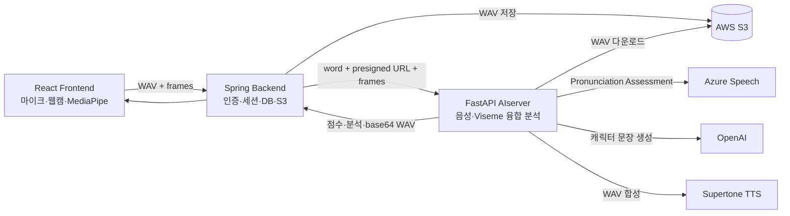
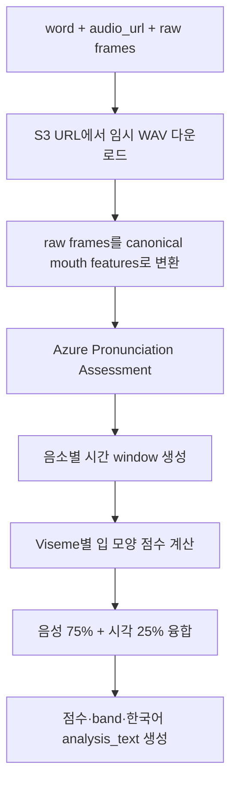
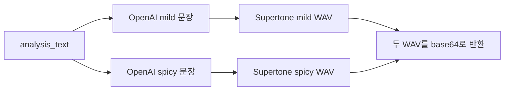

# Pronimo AI Server - AI/개발자 전달용 요약

이 문서는 Pronimo AIserver 저장소 전체를 다른 AI(ChatGPT, Codex 등)에 넘기지 않고도 현재 구현을 이해할 수 있도록 정리한 핸드오프 문서다.

> 중요: 아래 내용은 **현재 AIserver 코드에 실제로 구현된 기능**을 기준으로 한다. 최근 논의한 MQTT, ESP32, 조명 제어 등의 AIoT 기능은 아직 이 저장소에 구현되어 있지 않다.

---

## 1. 프로젝트 한 줄 설명

Pronimo는 사용자의 **영어 발음 음성**과 **MediaPipe 입 모양 데이터**를 함께 분석하여 0~10점의 발음 점수와 한국어 피드백을 제공하는 멀티모달 영어 발음 교정 서비스다.

AIserver는 FastAPI 기반 분석 서버이며 다음 작업을 담당한다.

1. S3 presigned URL에서 사용자의 WAV 파일 다운로드
2. Azure Speech Pronunciation Assessment로 영어 음성 분석
3. MediaPipe 얼굴 랜드마크·blendshape로 입 모양 분석
4. 음성 점수와 시각 점수를 융합
5. 규칙 기반 한국어 분석 문장 생성
6. OpenAI로 mild/spicy 캐릭터 피드백 생성
7. Supertone으로 캐릭터 피드백 WAV 생성

---

## 2. 전체 시스템에서 AIserver의 위치



### 역할 경계

| 계층 | 담당 역할 |
|---|---|
| Frontend | 녹음, 웹캠 캡처, MediaPipe 실행, 결과 및 3D 구강 모델 표시 |
| Spring Backend | JWT, 사용자·세션·점수 DB, WAV S3 업로드, presigned URL 생성, AIserver 중계 |
| AIserver | WAV 다운로드, Azure 음성 분석, 입 모양 분석, 점수 융합, GPT·TTS 호출 |
| AWS S3 | 사용자 녹음 파일 및 서비스 파일 저장 |

AIserver는 AWS SDK를 사용하거나 S3 자격증명을 직접 읽지 않는다. Backend가 생성한 presigned URL을 일반 HTTPS GET으로 다운로드할 뿐이다.

---

## 3. 기술 스택

- Python + FastAPI
- Pydantic
- Uvicorn
- HTTPX
- Azure Cognitive Services Speech SDK
- OpenAI Python SDK (`AsyncOpenAI`)
- Supertone REST API
- python-dotenv

의존성 목록은 `app/requirements.txt`에 있다.

---

## 4. 디렉터리 구조

```text
AIserver/
├── app/
│   ├── main.py
│   ├── requirements.txt
│   ├── api/
│   │   └── routes.py
│   ├── schemas/
│   │   └── request.py
│   ├── services/
│   │   ├── audio_fetcher.py
│   │   ├── azure_pa.py
│   │   ├── raw_frame_adapter.py
│   │   ├── viseme_mapper.py
│   │   ├── frame_aligner.py
│   │   ├── audio_scorer.py
│   │   ├── visual_viseme_scorer.py
│   │   ├── fusion_scorer.py
│   │   ├── feedback_payload_builder.py
│   │   ├── analysis_text_builder.py
│   │   ├── llm_feedback.py
│   │   └── tts_supertone.py
│   └── data/
│       ├── phoneme_to_viseme_map.json
│       ├── viseme_feature_profile.json
│       └── mediapipe_mouth_feature_catalog.json
├── API_SCHEMA.md
├── BACKEND_DTO.md
├── README.md
└── README_파이프라인.md
```

---

## 5. FastAPI 엔트리포인트

`app/main.py`가 FastAPI 애플리케이션을 생성하고 `app/api/routes.py`의 라우터를 등록한다.

현재 엔드포인트는 두 개다.

| Method | Path | 역할 |
|---|---|---|
| POST | `/analyze` | 음성·입 모양 분석 후 점수와 분석 문장 반환 |
| POST | `/feedback-wav` | 분석 문장을 mild/spicy 캐릭터 음성으로 변환 |

현재 `GET /`, `GET /health`, 인증, rate limit은 구현되어 있지 않다. 따라서 `GET /`의 404는 서버 장애가 아니다. Swagger UI는 `/docs`, OpenAPI JSON은 `/openapi.json`에서 확인한다.

---

## 6. `/analyze` API

### 요청

```json
{
  "word": "apple",
  "audio_url": "https://bucket.s3.ap-northeast-2.amazonaws.com/...?X-Amz-Signature=...",
  "frames": [
    {
      "t_ms": 0.0,
      "face_landmarks": [
        { "x": 0.5, "y": 0.4, "z": -0.02 }
      ],
      "face_blendshapes": {
        "jawOpen": 0.31,
        "mouthPucker": 0.08
      }
    }
  ]
}
```

실제 `face_landmarks`에는 MediaPipe Face Landmarker의 전체 얼굴 랜드마크가 들어간다. 프로젝트 문서 기준으로 478개 랜드마크와 얼굴 blendshape 값을 사용한다.

### 응답

```json
{
  "word": "apple",
  "scores": {
    "overall_0_10": 8.2,
    "audio_0_10": 8.5,
    "visual_0_10": 7.1,
    "band": "good"
  },
  "analysis_text": "음성: /p/ 소리를 조금 더 분명하게 내보세요.\n입모양: 입술 움직임은 안정적이에요."
}
```

모든 점수는 0~10 범위다. `band`는 다음 문자열 중 하나다.

```text
excellent | good | needs_attention | weak
```

### 처리 순서



### 오디오 다운로드 안전장치

`app/services/audio_fetcher.py`는 `audio_url`을 임시 `.wav` 파일로 다운로드한다.

- 최대 파일 크기: 25MB
- 허용 Content-Type: `audio/*`, `application/octet-stream`
- connect timeout: 5초
- read timeout: 15초
- redirect 허용
- 빈 파일 거부
- 요청 처리 후 임시 파일 삭제

AIserver가 접근할 수 있는 HTTPS URL이어야 하며, presigned URL이 만료되면 다운로드가 실패한다.

---

## 7. Azure Speech 발음 분석

구현 파일: `app/services/azure_pa.py`

주요 설정:

- 언어: `en-US`
- reference text: 요청의 `word`
- grading system: `HundredMark`
- granularity: `Phoneme`
- phoneme alphabet: `SAPI`
- NBest phoneme count: 5
- prosody assessment 활성화를 시도

Azure 결과에서 다음 정보를 추출한다.

- 음소 문자열
- AccuracyScore
- ErrorType
- NBestPhonemes
- Offset
- Duration
- FluencyScore
- CompletenessScore

Azure의 Offset과 Duration을 밀리초로 변환하여 음소와 카메라 프레임을 시간축으로 정렬한다.

대표 오류 타입:

```text
None
Mispronunciation
Omission
Insertion
UnexpectedBreak
MissingBreak
Monotone
```

---

## 8. 입 모양·Viseme 분석

입 모양 분석은 원본 영상을 AIserver로 보내는 방식이 아니라 Frontend에서 MediaPipe가 생성한 수치 데이터를 사용한다.

### 주요 단계

1. `raw_frame_adapter.py`
   - MediaPipe raw landmarks와 blendshape를 분석용 canonical feature로 변환
   - 입술, 턱, 입 벌림·오므림 등 핵심 입 모양 특징 사용

2. `viseme_mapper.py`
   - Azure가 반환한 영어 음소를 프로젝트의 viseme 그룹으로 매핑
   - 매핑 데이터: `app/data/phoneme_to_viseme_map.json`

3. `frame_aligner.py`
   - Azure 음소 Offset/Duration을 기준으로 해당 시간 구간의 카메라 프레임을 정렬
   - 프로젝트 문서 기준 음소 주변 약 ±80ms window를 활용

4. `visual_viseme_scorer.py`
   - 정답 viseme profile과 사용자의 입 모양 특징을 비교
   - profile: `app/data/viseme_feature_profile.json`
   - pattern, absolute, gaussian, skip 계열 비교 규칙 사용

이 구조는 음성만으로 구분하기 어려운 발음 문제를 입 모양 정보로 보조하는 것이 목적이다.

---

## 9. 점수 융합

구현 파일:

- `app/services/audio_scorer.py`
- `app/services/visual_viseme_scorer.py`
- `app/services/fusion_scorer.py`

현재 단어 수준과 음소 수준의 기본 가중치는 동일하다.

```text
음성 점수: 75%
입 모양 점수: 25%
```

개념식:

```text
overall = audio_score × 0.75 + visual_score × 0.25
```

실제 계산은 각 scorer의 정규화·신뢰도 처리 결과를 사용한다. 최종 API 응답은 `feedback_payload_builder.py`가 구성한다.

---

## 10. 규칙 기반 분석 문장

구현 파일: `app/services/analysis_text_builder.py`

`/analyze`는 GPT를 호출하지 않는다. 점수와 취약 음소를 바탕으로 규칙 기반의 2줄 한국어 문장을 생성한다.

```text
음성: ...
입모양: ...
```

따라서 `/analyze`에 필요한 외부 AI 키는 Azure Speech 키뿐이다. OpenAI와 Supertone은 `/feedback-wav`에서 사용한다.

---

## 11. `/feedback-wav` API

### 요청

```json
{
  "analysis_text": "음성: /p/ 소리를 조금 더 분명하게 내보세요.\n입모양: 입술 움직임은 안정적이에요."
}
```

### 응답

```json
{
  "mild_wav_base64": "UklGR...",
  "spicy_wav_base64": "UklGR...",
  "audio_format": "audio/wav"
}
```

### 처리 순서



OpenAI 두 요청과 Supertone 두 요청은 각각 `asyncio.gather()`로 병렬 실행한다.

---

## 12. OpenAI 캐릭터 피드백

구현 파일: `app/services/llm_feedback.py`

현재 설정:

- 모델: `gpt-4o-mini`
- API: Chat Completions
- 출력 형식: JSON object (`{"text": "..."}`)
- 최대 출력 토큰: 150
- mild temperature: 0.7
- spicy temperature: 0.9

캐릭터:

| mode | 설명 |
|---|---|
| mild | 따뜻하고 격려하는 다정한 햄스터, 존중하는 한국어 표현 |
| spicy | 까칠하고 직설적이지만 욕설·인격 모독은 하지 않는 햄스터 |

두 캐릭터 모두 입력 `analysis_text`에 없는 문제를 만들어내면 안 되며, 한국어 1~2문장, 약 60~80자를 목표로 한다.

화면에 표시되는 기본 `analysis_text`는 규칙 기반이며, GPT가 만든 mild/spicy 텍스트는 현재 API 응답에서 직접 반환하지 않고 Supertone 음성 생성에만 사용한다.

---

## 13. Supertone TTS

구현 파일: `app/services/tts_supertone.py`

호출 방식:

```text
POST https://supertoneapi.com/v1/text-to-speech/{voice_id}
Header: x-sup-api-key
```

현재 설정:

- language: `ko`
- model: `sona_speech_1`
- 응답: binary WAV
- AIserver가 binary를 base64로 변환하여 반환

현재 voice preset은 코드에 하드코딩된 placeholder다.

| mode | voice | style |
|---|---|---|
| mild | Anna placeholder | happy |
| spicy | Bert placeholder | angry |

Supertone에서 기존 voice ID가 사라졌거나 계정에 권한이 없으면 403/404가 발생할 수 있다. 운영 전 현재 계정에서 사용 가능한 한국어 voice ID와 style을 다시 확인해야 한다.

---

## 14. 환경변수

`AIserver/.env`에 다음 값을 둔다.

```dotenv
AZURE_SPEECH_KEY=
AZURE_SPEECH_REGION=koreacentral
OPENAI_API_KEY=
SUPERTONE_API_KEY=
```

용도:

| 변수 | 사용 위치 | 필수 API |
|---|---|---|
| `AZURE_SPEECH_KEY` | `azure_pa.py` | `/analyze` |
| `AZURE_SPEECH_REGION` | `azure_pa.py` | `/analyze` |
| `OPENAI_API_KEY` | `llm_feedback.py` | `/feedback-wav` |
| `SUPERTONE_API_KEY` | `tts_supertone.py` | `/feedback-wav` |

기존 README에는 AWS 환경변수도 적혀 있지만 현재 AIserver 코드에서는 읽지 않는다. AWS 키는 presigned URL을 생성하고 S3에 업로드하는 Spring Backend 측에 필요하다.

`.env`는 Git에 커밋하면 안 된다.

---

## 15. 로컬 실행

기존 README의 `cd app && uvicorn main:app`보다 다음 방식이 현재 import 구조에 안전하다.

```bash
cd AIserver

python3 -m venv .venv
source .venv/bin/activate

python -m pip install --upgrade pip
python -m pip install -r app/requirements.txt

python -m uvicorn app.main:app \
  --host 0.0.0.0 \
  --port 8000 \
  --reload
```

확인:

```bash
curl -I http://127.0.0.1:8000/docs
curl http://127.0.0.1:8000/openapi.json
```

EC2 또는 운영 환경에서는 `--reload`를 제거하고 systemd, Docker 또는 프로세스 매니저로 실행한다.

---

## 16. Backend 연동

Spring Backend는 다음 환경변수로 AIserver 주소를 설정한다.

```dotenv
FASTAPI_BASE_URL=http://AI_SERVER_PRIVATE_IP:8000
FASTAPI_ANALYZE_PATH=/analyze
FASTAPI_FEEDBACK_WAV_PATH=/feedback-wav
```

Backend와 AIserver가 같은 EC2라면 다음 주소를 사용할 수 있다.

```dotenv
FASTAPI_BASE_URL=http://127.0.0.1:8000
```

서로 다른 EC2지만 같은 VPC라면 AIserver의 private IP를 사용하는 것을 권장한다. AIserver 보안 그룹의 8000번 포트는 Backend 보안 그룹에서만 접근할 수 있도록 제한한다.

---

## 17. 오류 처리 요약

### `/analyze`

- 빈 `frames`: 400
- audio URL 다운로드 실패·timeout·잘못된 Content-Type: 400
- 유효한 얼굴 프레임 추출 실패: 400
- Azure 분석 실패: 400
- 그 밖의 내부 예외: 500
- 임시 WAV는 성공·실패 여부와 관계없이 정리

### `/feedback-wav`

- `OPENAI_API_KEY` 미설정: 500
- OpenAI 호출 실패: 502
- `SUPERTONE_API_KEY` 미설정: 500
- Supertone 네트워크·API 오류: 502

---

## 18. 현재 제한사항과 주의점

1. **영어 전용**
   - Azure 언어가 `en-US`로 고정되어 있다.
   - phoneme-to-viseme 데이터도 영어 발음 중심이다.

2. **단어 중심**
   - 요청 필드가 `word`이며 현재 scoring·피드백도 단어 학습 흐름에 맞춰져 있다.
   - 문장으로 확장할 때 word/phoneme aggregation을 다시 검토해야 한다.

3. **카메라 프레임 필수**
   - `/analyze`는 frames가 비어 있으면 거부한다.
   - audio-only fallback이 없다.

4. **외부 서비스 의존**
   - Azure, OpenAI, Supertone의 키·결제·quota·네트워크 상태에 영향을 받는다.

5. **TTS voice ID placeholder**
   - Anna/Bert voice ID가 현재 계정에서 유효한지 확인이 필요하다.

6. **health check 없음**
   - 배포 모니터링용 `/health` 추가를 권장한다.

7. **인증·rate limit 없음**
   - AIserver는 Backend 내부망에서만 접근하도록 배포하는 것이 안전하다.

8. **base64 WAV 응답 크기**
   - mild/spicy WAV 두 개를 JSON base64로 반환하므로 응답 크기와 timeout에 주의해야 한다.

9. **CORS 제한**
   - `app/main.py`에는 일부 localhost origin만 등록되어 있다.
   - 현재 권장 구조는 Browser → Backend → AIserver의 서버 간 통신이다.

10. **AWS 자격증명 미사용**
    - AIserver `.env`에 AWS 키를 넣어도 현재 코드에서는 사용하지 않는다.

---

## 19. 현재 구현되지 않은 기능

다음은 최근 대회 아이디어에서 논의했지만 현재 AIserver 저장소에는 없는 기능이다.

- MQTT Broker 연동
- ESP32/Arduino 펌웨어
- IoT 조명·서보모터·교구 제어
- 점수 통과 기준에 따른 장치 명령 발행
- IoT 장치 등록·상태 모니터링
- `device_id` 기반 요청·로그
- 특수학교 교사용 IoT 대시보드

추후 AIoT 기능을 추가한다면 권장 책임 분리는 다음과 같다.

```text
FastAPI: 발음 분석과 점수 반환
Spring Backend: 점수 기준·장치 권한·단어-명령 매핑
MQTT Broker: 명령 전달
ESP32: MQTT 명령 수신 후 실제 LED/모터 작동
```

GPT가 생성한 자유 텍스트로 장치를 직접 제어하면 안 된다. Backend가 사전에 등록한 allowlist 명령만 실행해야 한다.

---

## 20. 다른 AI에게 전달할 때 함께 사용할 프롬프트

아래 문장을 이 파일과 함께 전달하면 된다.

```text
첨부한 README_AI_HANDOFF.md는 Pronimo AIserver의 현재 구현을 요약한 문서야.
문서에서 "현재 구현"과 "향후 AIoT 확장"을 구분해서 이해해줘.

특히 다음 원칙을 지켜줘.
1. 기존 FastAPI는 영어 음성과 MediaPipe 입 모양을 융합 분석한다.
2. /analyze는 Azure를 사용하지만 GPT와 TTS는 호출하지 않는다.
3. /feedback-wav에서 OpenAI와 Supertone을 호출한다.
4. AWS S3 업로드와 presigned URL 생성은 Spring Backend의 책임이다.
5. MQTT와 ESP32 제어는 아직 구현되지 않은 확장 기능이다.
6. 코드를 수정하거나 제안할 때 기존 API 계약과 Backend 연동을 먼저 고려해줘.
```

---

## 21. 핵심 파일 우선순위

코드를 추가로 확인해야 한다면 다음 순서로 읽으면 된다.

1. `app/api/routes.py`
2. `app/schemas/request.py`
3. `app/services/azure_pa.py`
4. `app/services/raw_frame_adapter.py`
5. `app/services/frame_aligner.py`
6. `app/services/visual_viseme_scorer.py`
7. `app/services/fusion_scorer.py`
8. `app/services/feedback_payload_builder.py`
9. `app/services/llm_feedback.py`
10. `app/services/tts_supertone.py`

더 상세한 기존 문서는 다음과 같다.

- `README_파이프라인.md`: FE → Backend → AIserver 전체 흐름
- `API_SCHEMA.md`: FastAPI 요청·응답 명세
- `BACKEND_DTO.md`: Spring Backend 연동 DTO

